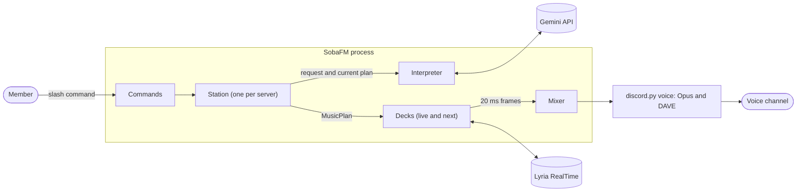

# Architecture

- **Status:** Approved (#5); the playback engine follows ADR-0004 (#12).
- **Requirements:** [requirements.md](requirements.md)
- **Decisions:** [ADR-0001](decisions/0001-build-on-python-discord-py-and-the-google-gen-ai-sdk.md) · [ADR-0002](decisions/0002-interpret-requests-with-gemini-structured-output.md) · [ADR-0003](decisions/0003-keep-server-state-in-sqlite-and-use-discord-command-permissions.md) · [ADR-0004](decisions/0004-stream-lyria-realtime-through-buffered-decks.md)

## Summary

SobaFM is a single Python process built on discord.py. It keeps one **station** per server. A station holds the current **program**, asks Gemini to interpret each request into a `MusicPlan`, and keeps audio flowing by filling **decks** (frame buffers fed by Lyria RealTime sessions) and crossfading between them in a **mixer** that discord.py reads every 20 ms.

## Scope

In scope: the v1 [requirements](requirements.md). Out of scope: hosting several voice channels per server, horizontal scaling, and a hosted public instance. One process serves the servers that invite its Discord application.

## Platform constraints

| Constraint | Source | Design response |
| --- | --- | --- |
| Lyria RealTime emits raw 16-bit PCM at 48 kHz in stereo, in chunks of about 2 seconds | [Lyria RealTime guide](https://ai.google.dev/gemini-api/docs/realtime-music-generation) | The format Discord encodes to Opus: chunks are split into 3,840-byte, 20 ms frames with no resampling |
| Audio is generated ahead of playback, and prompt changes affect only audio generated afterwards | Lyria RealTime guide | Every plan change fills a new deck and crossfades to it, instead of steering a session whose audio is already buffered |
| Every config update must include all fields, and `bpm` or `scale` changes need a hard context reset | Lyria RealTime guide | The full config is sent with every new session; tempo and key change only between decks |
| Sessions close after 600 seconds with WebSocket code 1011 and no warning; audio starts a median 2.9 seconds after `play()` | Measured in #11; not in the official documentation | Sessions are retired after 540 seconds; a deck goes live after a 6-second pre-roll |
| Generation averages 0.97× to 0.99× real time per session, with per-minute dips to 0.77× and stalls of up to 17 seconds | Measured in #11 | The next deck fills up to 60 seconds ahead, so the deck taking over can absorb stalls |
| Four concurrent sessions work when started apart; a session started seconds after others can be refused with a `filtered_prompt` | Measured in #11 | Two sessions per playing server; a refused start is retried once after 30 seconds |
| discord.py calls `AudioSource.read()` on its player thread every 20 ms, and an empty result ends playback | [discord.py API reference](https://discordpy.readthedocs.io/en/stable/api.html#discord.AudioSource) | `read()` never blocks and returns silence on underrun |
| Discord accepts only DAVE end-to-end-encrypted voice connections since March 1, 2026 | [Discord change log](https://docs.discord.com/developers/change-log) | discord.py 2.7 with its `voice` extra (ADR-0001) |

## Existing-solution review

| Need | Solution | Notes |
| --- | --- | --- |
| Gateway, slash commands, voice, Opus, DAVE | discord.py 2.7 | ADR-0001 |
| Gemini and Lyria RealTime | Google Gen AI SDK | Official SDK; asynchronous `live.music` client |
| Validation and configuration | Pydantic, pydantic-settings | Schema for model output; typed environment settings |
| Gain and mixing | `audioop` (`audioop-lts`) | C implementation, already a discord.py dependency |
| Persistence | Standard library `sqlite3` | ADR-0003 |
| Access control | Discord command permissions | ADR-0003 |
| Continuous playback from Lyria sessions | Custom: decks, mixer, station | No library mixes live PCM streams into a discord.py audio source. Audio servers such as Lavalink play tracks from sources and cannot take a live PCM stream |

## Design



| Module | Responsibility |
| --- | --- |
| `__main__` | Entry point: configuration, logging, signal handling, and a startup watchdog |
| `config` | Typed settings from the environment and `.env`; secrets held as `SecretStr` |
| `bot` | The discord.py client: intents, command sync, the station registry, and voice-state events |
| `commands` | Slash command handlers: checks, deferral, and replies with mentions disabled |
| `station` | One per server: the desired program, the reconcile loop, listener tracking, and the voice channel status |
| `deck` | One Lyria RealTime session filling a buffer of 20 ms frames, with flow control |
| `mixer` | The `discord.AudioSource`: the live deck, crossfades, fades, and volume |
| `pcm` | PCM format constants, the silence frame, and the chunk-to-frame splitter |
| `plan` | `MusicPlan` and its mapping to Lyria prompts and the full generation config |
| `interpreter` | The Gemini call, its instruction, and the refusal and fallback policies |
| `store` | Per-server state in SQLite |

`scripts/lyria_probe.py` measures Lyria RealTime's behavior and is kept so the measurements can be repeated after SDK or model changes.

### Playback engine

A **deck** is a buffer of 20 ms frames filled by at most one Lyria RealTime session. A playing server keeps two decks generating: the **live** deck, which the mixer plays, and the **next** deck, which fills ahead. A session is retired when it reaches the session limit or when its plan is replaced, and its buffered audio stays playable. Session rotation, recovery from a dropped session, stalls, and plan changes therefore follow one path: hand over to the next deck with a crossfade, then open a new next deck ([ADR-0004](decisions/0004-stream-lyria-realtime-through-buffered-decks.md)).

Flow control uses only `pause()` and `play()`: a deck pauses generation when it holds 60 seconds of audio and resumes below 45 seconds. The receive loop is never throttled, because unread messages would delay WebSocket keepalive replies.

The **mixer** is the audio source discord.py reads. Each `read()` returns exactly one 3,840-byte frame from the live deck, mixed during a handover with the incoming deck using equal-power gains. Gain is the smoothed volume multiplied by the current fade, applied with `audioop`. On underrun, and on any exception, `read()` returns silence, so the player never stops on its own. Crossfades are counted in frames, so they pause intact while discord.py reconnects to voice.

### Threads and buffers

- The **event loop** runs the gateway, commands, Gemini calls, Lyria sessions, and the reconcile loop. Store calls run in a worker thread through `asyncio.to_thread`.
- discord.py's **player thread** calls `Mixer.read()` every 20 ms.
- Frames cross between the two through each deck's `collections.deque`, whose appends and pops are thread-safe.
- The mixer's control state (live deck, pending switch, volume) sits behind one `threading.Lock`, held only for constant-time reads and writes.
- The mixer never calls into the event loop; the station observes it on each tick. The only cross-thread signal is discord.py's `after` callback, delivered with `loop.call_soon_threadsafe`.

### Station reconcile loop

A station stores only what should be happening: the program (plan, requester, and end time) or none. Its `reconcile()` method runs every 250 ms and whenever a command or event wakes it, and it is the only code that creates, switches, or closes decks. It applies these rules in order:

1. **End.** If SobaFM has lost its voice connection, the program's end time has passed, or the channel has had no listeners for 60 seconds, clear the program.
2. **Discard.** Drop ended decks the mixer no longer references once they are empty or replaced. A deck that ended without audio counts as a failed or refused start.
3. **Retire.** Stop the session of any deck that has reached the session limit or belongs to a replaced plan. Its buffered audio stays playable.
4. **Generate.** Keep a next deck filling for the current plan beside the live one, within the global session cap. Retry failed connections with backoff, and retry a refused start once after 30 seconds.
5. **Start.** If nothing is playing and a deck for the current plan has its pre-roll, start the player and fade in. Restart the player if discord.py stopped it.
6. **Hand over, or stop.** With a program, if no crossfade is in progress and the live deck holds less than 4 seconds or belongs to a replaced plan, crossfade to the ready deck with the most buffered audio, preferring the current plan. Without one, retire idle decks, fade out the live deck, and then stop the player.
7. **Regulate.** Pause or resume each deck's generation at the flow-control thresholds.

The station never closes a deck the mixer still references. Commands only replace the desired program and wake the loop, so they need no lock: the latest request wins. The change cooldown (M3) is checked when a request arrives, before the model call.

### Constants

Set by ADR-0004 from the measurements in #11.

| Constant | Value | Purpose |
| --- | --- | --- |
| Frame | 3,840 bytes | 20 ms of 16-bit, 48 kHz stereo PCM |
| Reconcile tick | 250 ms | Rule evaluation and flow-control checks |
| Pre-roll | 6 s | Audio a deck needs before it can go live, about three chunks |
| Pause and resume thresholds | 60 s and 45 s buffered | Flow control; the next deck stays paused at 60 s until it goes live |
| Session limit | 540 s | Retires sessions before the 600-second limit |
| Hand-over point and crossfade | 4 s remaining and 4 s | Start of a handover, and its length |
| Fade-in and fade-out | 2 s and 3 s | Program start and end |
| Refused-start retry | Once, after 30 s | Separates rate-limited session starts from filtered prompts |
| Session caps | 2 per server; 4 per process | Bounds Lyria usage; two playing servers per API key |
| Connect timeout and backoff | 15 s; 2, 5, then 15 s | Session recovery |
| Empty-channel grace period | 60 s | PLAY-4 |

The next deck reaches its 60-second buffer about a minute after it opens, well before the live session's 540-second limit, so each handover starts with a full minute of audio in reserve. A full deck holds about 11.5 MB of audio, and a playing server holds less than 40 MB in the worst case (NFR-3).

### Interpreter

The interpreter is SobaFM's only Gemini stage. It makes one call for each accepted `/play`:

- **Input:** the request text and the current plan, sent as data in the user turn. The system instruction distills the [Lyria prompt guide](https://ai.google.dev/gemini-api/docs/lyria-prompt-guide), asks for instrumental descriptors in English, and has names of artists and works translated into descriptive terms.
- **Output:** JSON constrained by the schema below through [structured output](https://ai.google.dev/gemini-api/docs/structured-output), then validated with Pydantic.
- **Policy:** `not_music`, safety-blocked, and blank requests are refused. A timeout (10 seconds), rate limit, server error, or invalid output falls back to the request text, truncated to 120 characters, as a single prompt. For `refine`, the values an answer leaves out or unset are copied from the current plan: tempo, key, density, brightness, drum muting, and wordless vocals. Failures are logged by code, status, and error reason, never by message, since Gemini's messages can quote the API key.
- **Model:** `gemini-3.5-flash-lite` by default, set with `SOBAFM_GEMINI_MODEL`. The call uses the minimal thinking level and no tools; sampling parameters are not sent.

```python
class Prompt(BaseModel):
    text: str  # 1 to 120 characters
    weight: float  # 0.1 to 1.0


class MusicPlan(BaseModel):
    title: str  # 1 to 60 characters
    prompts: list[Prompt]  # 1 to 4 prompts
    bpm: int | None  # 60 to 200
    scale: Scale | None  # the SDK's scale enum
    density: float | None  # 0.0 to 1.0
    brightness: float | None  # 0.0 to 1.0
    mute_drums: bool
    vocalization: bool  # wordless vocals


class Interpretation(BaseModel):
    kind: Literal["new", "refine", "not_music"]
    plan: MusicPlan | None  # None only when kind is "not_music"
```

`MusicPlan.to_config()` always builds the complete Lyria config. Guidance (4.0), temperature (1.1), and top-k (40) stay at Lyria's defaults, the mode is `QUALITY` (or `VOCALIZATION` for wordless vocals), and no seed is set.

## Data model

```sql
CREATE TABLE guild (
    guild_id   INTEGER PRIMARY KEY,
    channel_id INTEGER,           -- remembered voice channel, or NULL
    settings   TEXT    NOT NULL,  -- GuildSettings as JSON
    updated_at TEXT    NOT NULL   -- ISO 8601, UTC
);
```

`GuildSettings` is a Pydantic model with the defaults and ranges in [SET-1 to SET-3](requirements.md#settings). Missing fields take their defaults and unknown fields are ignored, so adding a setting needs no migration.

## Interfaces

**Slash commands** are specified in the [requirements](requirements.md#commands).

**Configuration** comes from environment variables or a `.env` file:

| Variable | Required | Default | Purpose |
| --- | --- | --- | --- |
| `DISCORD_TOKEN` | Yes | None | Discord bot token |
| `GEMINI_API_KEY` | Yes | None | Gemini API key, used for interpretation and Lyria RealTime |
| `SOBAFM_GEMINI_MODEL` | No | `gemini-3.5-flash-lite` | Interpreter model |
| `SOBAFM_DATA_DIR` | No | `./data` | Directory for the SQLite database |
| `SOBAFM_LOG_LEVEL` | No | `INFO` | Log level |
| `SOBAFM_DEV_GUILD_ID` | No | None | Registers commands to one server for development |
| `SOBAFM_MAX_SESSIONS` | No | `4` | Global cap on concurrent Lyria RealTime sessions |

**Discord invitation:** scopes `bot` and `applications.commands`; permissions View Channel, Connect, Speak, and Set Voice Channel Status.

## State and lifecycle

- **Program:** created by an accepted `/play` and replaced by the next one; cleared when its end time passes, by `/stop` or `/leave`, after the empty-channel grace period, or when SobaFM loses its channel. The phase shown by `/now` (idle, starting, playing, or stopping) is derived from the program and the mixer rather than stored.
- **Deck:** `connecting`, then `generating` (paused or not), then `ended` with a reason: retired, closed with a close code, failed, or filtered. A deck is ready once it holds the pre-roll. Its generation rate is audio seconds received per unpaused wall-clock second, measured after 10 seconds.
- **Startup:** load and validate configuration, open the store, connect to the gateway, and sync commands. Each server's remembered channel is rejoined when that server becomes available: at startup, after a new gateway session, or when an outage ends. The watchdog exits with an error if the gateway is not ready within 120 seconds, so the process supervisor restarts SobaFM.
- **Shutdown:** on `SIGTERM`, cancel station tasks (which closes their Lyria sessions), disconnect from voice, and close the client.

## Failure behavior

| Failure | Behavior |
| --- | --- |
| Gemini timeout, rate limit, server error, or invalid output | Fall back to the request text and say so in the reply |
| Not-music request or Gemini safety block | Refuse with a short explanation; nothing reaches Lyria |
| Lyria filters a prompt | Discard the new deck, keep the current music, and tell the requester |
| Lyria refuses the connection (authentication, quota, or close code `1008`) | Reply with a specific error; the station stays idle |
| Lyria session closes during a program | Its buffer keeps playing while a replacement deck fills; repeated failures end the program with a notice |
| Generation stalls or slows | The live deck's buffer absorbs it; below 4 seconds, the station hands over to the next deck. Remaining underruns play silence and are logged |
| Lyria refuses a new session's start (`filtered_prompt` with no audio) | Retry once after 30 seconds, then report the prompt as filtered |
| No session capacity left in the process | Reply that SobaFM is busy in other servers |
| Voice reconnection | discord.py reconnects; reads pause, flow control pauses generation, and crossfades resume intact |
| SobaFM moved, disconnected, or its channel deleted | Adopt the new channel, or end the program and forget the channel (PLAY-7). Discord reports every disconnect alike, so a voice connection that discord.py gives up reconnecting is also forgotten |
| New gateway session (a reconnect that cannot resume) | discord.py forgets its voice clients, so the program ends. SobaFM closes the old voice connection, which takes up to 30 seconds, then rejoins the remembered channel |
| Player thread error | `read()` returns silence; the `after` callback wakes the station, which restarts the player |
| Gateway not ready at startup | The watchdog exits with an error and the process supervisor restarts SobaFM |

## Security and privacy

- **Secrets** come only from the environment, are held as `SecretStr`, and are never logged. `.env` files are git-ignored.
- **Data sent to Google:** the request text and current plan go to Gemini; prompts and generation settings go to Lyria RealTime. Discord identifiers are never sent. Google may review prompts sent on the free tier, which the README states (USE-1, USE-2).
- **Model output is untrusted.** It is validated against the schema before use; text shown in Discord is escaped, length-capped, and sent with mentions disabled; nothing is executed.
- **Prompt injection:** the instruction treats the request as data, and the schema limits what any request can produce.
- **Least privilege:** two non-privileged gateway intents and four channel permissions.
- **Logs:** request text appears only at debug level.

## Testing

| Level | Scope | Tooling |
| --- | --- | --- |
| Unit | Framing, mixer gains, plan validation and config mapping, the store | pytest |
| Component | Deck and station rules against a fake Lyria session and a fake clock; command handlers with mocked interactions | pytest, pytest-asyncio |
| Evaluation | About 30 interpreter cases with property checks: valid output for every case, every not-music and injection case refused, tempo within the expected band, refinements keeping tempo and key, no artist names; at least 90% of checks passing | `pytest -m eval` with `GEMINI_API_KEY`; not run in CI |
| Live | The Lyria probe, smoke tests, and the 60-minute soak test | `scripts/lyria_probe.py`, a private Discord server |

## Deployment

SobaFM runs from source with `uv run sobafm`. From M4 it also ships as a multi-architecture container image on GitHub Container Registry, based on `python:3.14-slim` with `libopus0`, running as a non-root user with a `/data` volume. The compose file sets an init process and `restart: unless-stopped`.

## Open questions

| Question | Tracking |
| --- | --- |
| Session limit, generation rate, concurrency, settle time, and API version | Answered in #11 |
| Playback engine constants, the number of sessions per server, and whether continuous playback is achievable | Answered in ADR-0004 (#12) |
